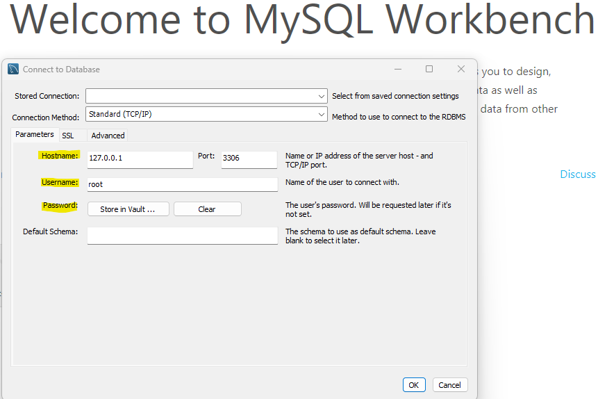
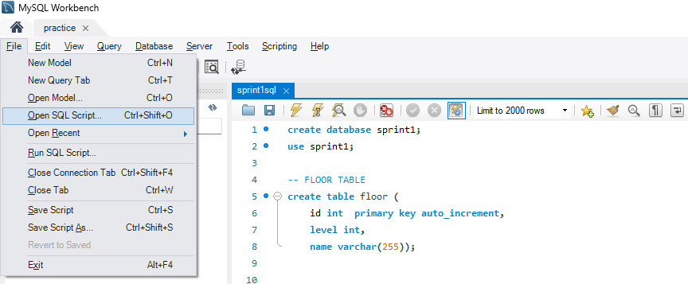
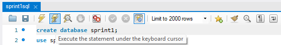
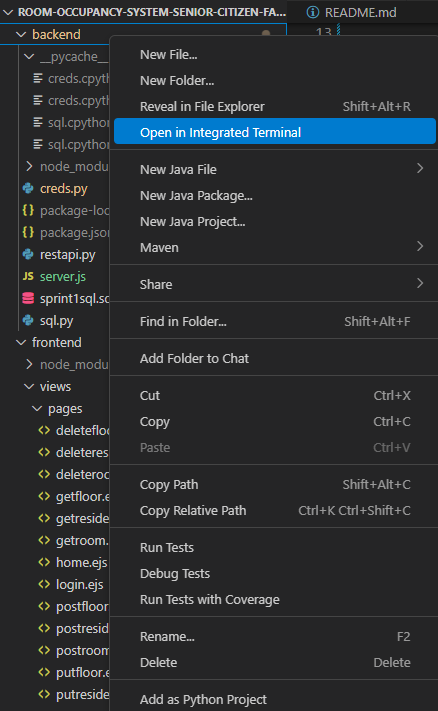
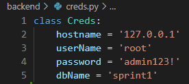
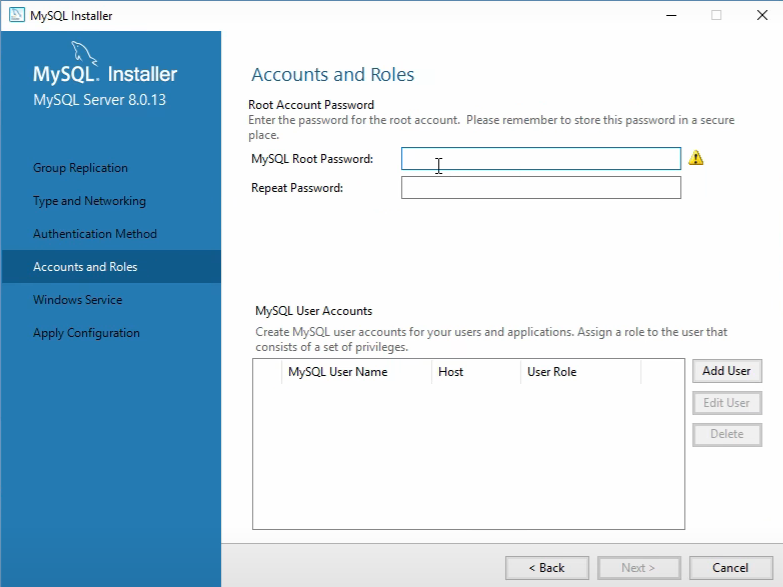

## **Room Occupancy System**
Users can manage a MySQL database (tables: *floor*, *room*, *resident*) by performing CRUD operations (create, read, update, delete) through the user interface. Essentially, users can insert, retrieve, update, and delete records in the database.
<details><summary>Learning Outcomes</summary>  

- Developing a full-stack, web-based information system (frontend and backend)  
- Handling HTTP requests, responses, and page rendering with Express, Axios, and Flask
- Writing Application Programming Interfaces (APIs) to perform CRUD operations on MySQL database based on HTTP requests
</details>

## Architecture
<u>**Foundations**</u>  
- **Python** - used for writing REST APIs in Flask
- **Node.js** - runs JavaScript servers

<u>**Backend Servers**</u>  
- **Express** - web framework for Node.js
    - Listens to HTTP requests, handles routes and responses, and renders pages  
- **Flask** - web framework for Python to build a web application with REST APIs
    - Used for writing Python REST APIs to return JSON data and interact with MySQL database

<u>**HTTP Client**</u>  
- **Axios** - Used to send HTTP requests (users' GET, PUT, POST, DELETE data) from the frontend to API endpoints written to receive the responses<br>
---
## **Directions to Run** 
### <u>Database Setup</u>
1. **Download MySQL Server and MySQL Workbench:**  
https://www.youtube.com/watch?v=u96rVINbAUI&t=62s  
**Note:** Remember *MySQL Root Password* to change credentials in **creds.py** later
2. **Create your own MySQL connection**  
**Note:** Remember *Hostname* and *Username* to change credentials in **creds.py** later if need be  



3. **Create MySQL database name "sprint1" in MySQL connection**:
    - **Open SQL script** and select **sprint1sql.sql** file in **backend** folder
    
    - Execute SQL statements by placing your cursor at the end of each statement and clicking the lightning bolt with a cursor at the top:
    
        ```sql 
        -- Execute to create "sprint1" database
        create database sprint1;

        -- Execute to use "sprint1" database
        use sprint1;
        
    - Execute SQL statements to create tables *floor*, *room*, and *resident*:  
        ```sql 
        --Floor table example:

        --Execute to create floor table
        create table floor (
        id int  primary key auto_increment,
        level int,
        name varchar(255));

        --Execute insertion query for floor table
        insert into floor values 
        (-1, -1, 'basement'), 
        (null, 1, '1st'), 
        (null, 2, '2nd'), 
        (null, 3, '3rd');
  
### <u>Environment Setup</u>
1. **Download and install Node.js on computer:** https://www.youtube.com/watch?v=7pbQ4ZKPBiU  
2. **Download zip file, extract, and open folder in VS Code**
<br><br>

3. **Open Terminal in *backend* folder and install the following:**  
    - **Install flask:** `pip install flask`  
    - **Install express:** `npm install express`  
    - **Install axios:** `npm install axios`  
    - **Install ejs:**`npm install ejs`  
    - **Install MySQL connector for Python:** `pip install mysql-connector-python`<br><br>
  

4. Change credentials in creds.py if need be  
 

5. Test MySQL database connection by running `python restapi.py` in the Terminal of *backend* folder  
(You should see "Connection to MySQL DB successful")


6. Open another Terminal in the ***backend*** folder and run `node server.js` to run the room occupancy system
    - Ctrl + click the localhost link to launch the system:

    - You should see the login page once launched:


7. **Login credentials to enter welcome page and access the room occupancy system:**  
user = cis  
password = 3368

